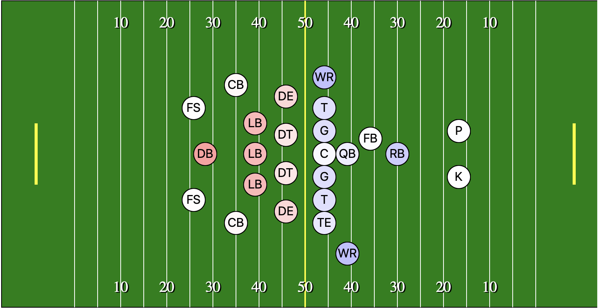

 

* Team Members: Ashley Patterson, Upendra Addepalle, George Bendele, Mrinalini 

* [https://ut-nfl-edu2.herokuapp.com/](https://ut-nfl-edu2.herokuapp.com/)

* [Dataset](https://www.reddit.com/r/NFLstatheads/comments/bmrwgp/i_scraped_a_bunch_of_nfl_data_from_2002_through/ "dataset")

## Motivation
To make a large NFL dataset accessible to users through interactive web visualizations. 

## Visualizations

### NFL Draft Picks by Position

* Lets the user see what positions are most often picked through a heatmap. 
* Hover over tool tip gives exact number of picks for each position. 
* Created using [D3js](https://d3js.org)

 

### NFL Teams Statistics 

* This interactive chart attempts to visually compare various team statistics between 2009 - 2019.
* Created using [Highcharts](https://www.highcharts.com)

 

### NFL Player Injuries

* This visualization charts NFL injury counts by team over the course of each season (2009-2018).
* Created using [Highcharts](https://www.highcharts.com)

 

### Weather and Winning 

* This visualization shows Home vs. Away team performance correlation with environmental variables.
* Created using [D3js](https://d3js.org)

 

## ETL 
Our dataset was an SQlite database so most of the ETL was handled through queries like the example below. 

~~~python
@app.route("/teamstats/<season>")
def team_stats_metadata(season):
    """Return the MetaData for a given sample."""

    results = db.engine.execute("select st.season,\
        t.team,\
        t.team_name,\
        sum(st.pass_attempts) as pass_attempts,\
        sum(st.pass_completions) as pass_completions,\
        sum(st.pass_tds) as pass_touchdowns,\
        sum(st.rush_attempts) as rush_attempts,\
        sum(st.rush_tds) as rush_touchdowns,\
        sum(st.first_downs) as first_downs,\
        sum(st.sacks) as sacks,\
        sum(st.pass_interceptions) as pass_interceptions,\
        sum(st.fumbles) as fumbles,\
        sum(st.fumbles_lost) as fumbles_lost,\
        sum(st.turnovers) as turnovers,\
        sum(st.pentalties) as penalties\
    from stats_team st,\
         teams t\
    where\
        st.team = t.team\
        and st.season=:season\
    group by st.season, st.team", {'season': season})

    # Create a dictionary entry for each row of metadata information
    team_stats = []
    for row in results:
        stats_dict = {}
        stats_dict["season"] = row[0]
        stats_dict["team"] = row[1]
        stats_dict["team_name"] = row[2]
        stats_dict["pass_attempts"] = row[3]
        stats_dict["pass_completions"] = row[4]
        stats_dict["pass_touchdowns"] = row[5]
        stats_dict["rush_attempts"] = row[6]
        stats_dict["rush_touchdowns"] = row[7]
        stats_dict["first_downs"] = row[8]
        stats_dict["sacks"] = row[9]
        stats_dict["pass_interceptions"] = row[10]
        stats_dict["fumbles"] = row[11]
        stats_dict["fumbles_lost"] = row[12]
        stats_dict["turnovers"] = row[13]
        stats_dict["penalties"] = row[14]
        team_stats.append(stats_dict)

    return jsonify(team_stats)
~~~

## Inspiration
* [http://content.fanatics.com/nfl-touchdowns/](http://content.fanatics.com/nfl-touchdowns/)

